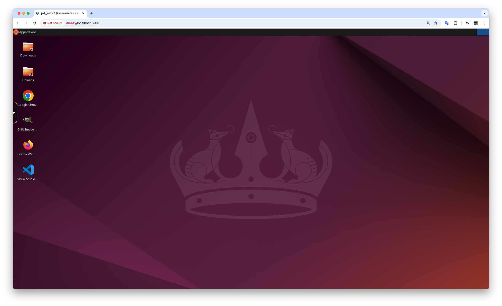
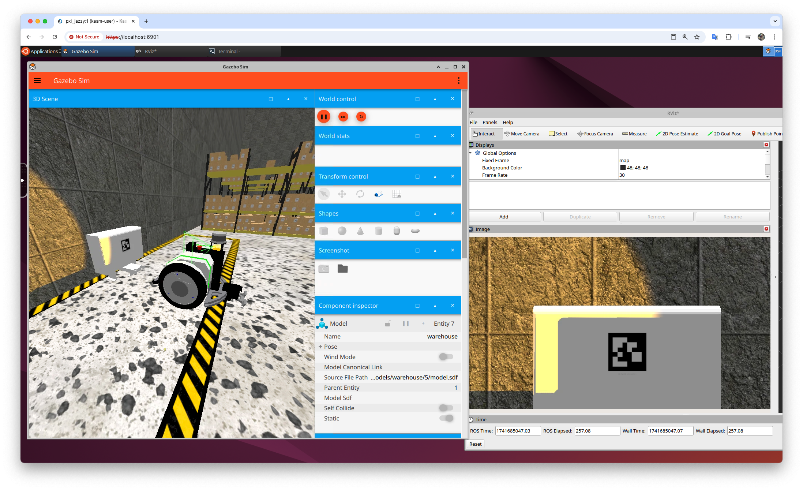
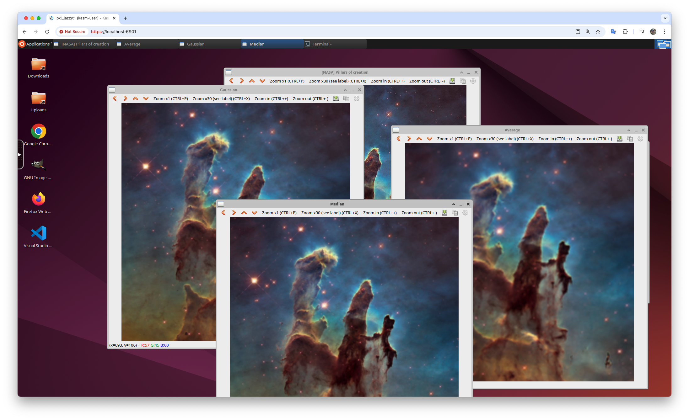

# PXL ROS2 Jazzy Docker Image with KasmVNC

This repository provides a Docker container for ROS2 Jazzy that includes **KasmVNC**, allowing users to access the Xfce desktop environment via HTTPS for running simulations and other ROS2 applications.

## Features
- **Ubuntu 24.04 Docker container** with **ROS2 Jazzy** pre-installed.
- **KasmVNC** for desktop access within the container.
- **Xfce Desktop** accessible via port **6901**. ([https://localhost:6901](https://localhost:6901) user: ``kasm_user`` password: ``password``.)
- Scripts to build, run, attach, stop, and remove the container and image.

## Requirements
- **Docker** installed on your system ([Install Docker](https://docs.docker.com/get-docker/)).
- Recommended: **NVIDIA GPU** with drivers and NVIDIA Container Toolkit for hardware acceleration (optional).

## Files in Repository
| File                                             | Description                                      |
|--------------------------------------------------|--------------------------------------------------|
| `pxl_ros2_jazzy_image`                           | Directory containing Docker image files.         |
| `001_build_pxl_ros2_jazzy_image.sh`              | Builds the Docker image.                         |
| `002_run_pxl_ros2_jazzy_container.sh`            | Runs the container from the built image.         |
| `003_attach_bash_to_pxl_ros2_jazzy_container.sh` | Opens a Bash shell inside the running container. |
| `997_stop_pxl_ros2_jazzy_container.sh`           | Stops the running container.                     |
| `998_remove_pxl_ros2_jazzy_container.sh`         | Removes the stopped container.                   |
| `999_remove_pxl_ros2_jazzy_image.sh`             | Removes the built Docker image.                  |

## Installation & Usage

### 1. Clone the Repository
```sh
git clone https://github.com/PXLAIRobotics/ROS2JazzyDocker.git
cd ROS2JazzyDocker
```

### 2. Build the Docker Image
```sh
./001_build_pxl_ros2_jazzy_image.sh
```

### 3. Run the Docker Container
```sh
./002_run_pxl_ros2_jazzy_container.sh
```

### 4. Access the Container via Bash
```sh
./003_attach_bash_to_pxl_ros2_jazzy_container.sh
```

### 5. Stop the Container
```sh
./997_stop_pxl_ros2_jazzy_container.sh
```

### 6. Remove the Container
```sh
./998_remove_pxl_ros2_jazzy_container.sh
```

### 7. Remove the Docker Image
```sh
./999_remove_pxl_ros2_jazzy_image.sh
```

## Accessing the Desktop Environment
After running the container, you can access the **KasmVNC** desktop by opening a web browser and navigating to:
```
https://localhost:6901
```
Default login credentials:
- **Username:** `kasm_user`
- **Password:** `password`

### Testing ROS2

To verify that ROS2 Jazzy is running correctly, follow these steps:

Open a terminal by clicking the ``Applications`` menu in the **top left corner** and selecting ``Terminal Emulator``.

Run the following command to start an example ROS 2 node:

```
ros2 run example_package example_node
```

If everything is set up correctly, you should see output similar to:

```
Hi from example_package.
```

This confirms that ROS 2 is properly installed and functional within the container.


## Showcase
Below are screenshots showcasing the usage of this ROS 2 Jazzy Docker container:

### Ubuntu Desktop

<p align="center">
  
</p>

### Running ROS 2 Simulation

<p align="center">
  
</p>

### OpenCV Example

<p align="center">
  
</p>

## Customization
- Modify the `Dockerfile` in `pxl_ros2_jazzy_image` to add additional dependencies.
- Update the scripts to configure network settings, volumes, or GPU access.

## Contributing
Feel free to fork this repository and submit pull requests for improvements or additional features.

## License
This project is licensed under the MIT License - see the [LICENSE](LICENSE) file for details.

## Third-Party Code Attribution
This project includes code from third-party sources:

- **Kasm Technologies**
  - The `src/` directory in `pxl_ros2_jazzy_image/` is a direct copy from Kasm Technologies' repository.
  - Portions of Kasm Technologies' code are also used in the `Dockerfile` with modifications.
  - Their original MIT license is retained in `pxl_ros2_jazzy_image/src/LICENSE`.

All third-party code follows their respective licenses.

## Author
Maintained by **Tim Dupont** ([GitHub Profile](https://github.com/TimDupontPXL)).

## Acknowledgments
Special thanks to:
- **Kasm Technologies** for developing **KasmVNC**, enabling seamless remote desktop access.
- **Open Source Robotics Foundation (OSRF)** for their continued work on **ROS2**.
- **Intel**, **Willow Garage**, **Itseez**, and the OpenCV community for developing and maintaining OpenCV, a powerful computer vision library widely used in robotics and AI.
- **Canonical** for maintaining **Ubuntu**, the foundation of this Docker container.
- The broader **open-source communities** that contribute to these technologies and make innovation possible.

