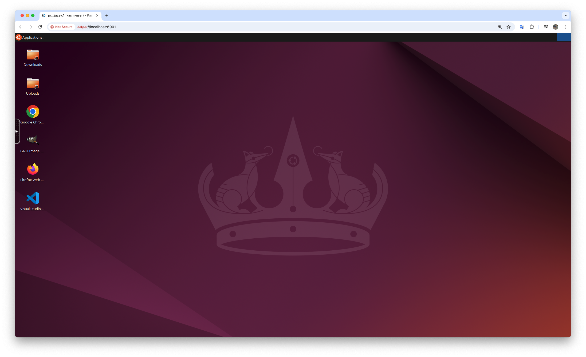
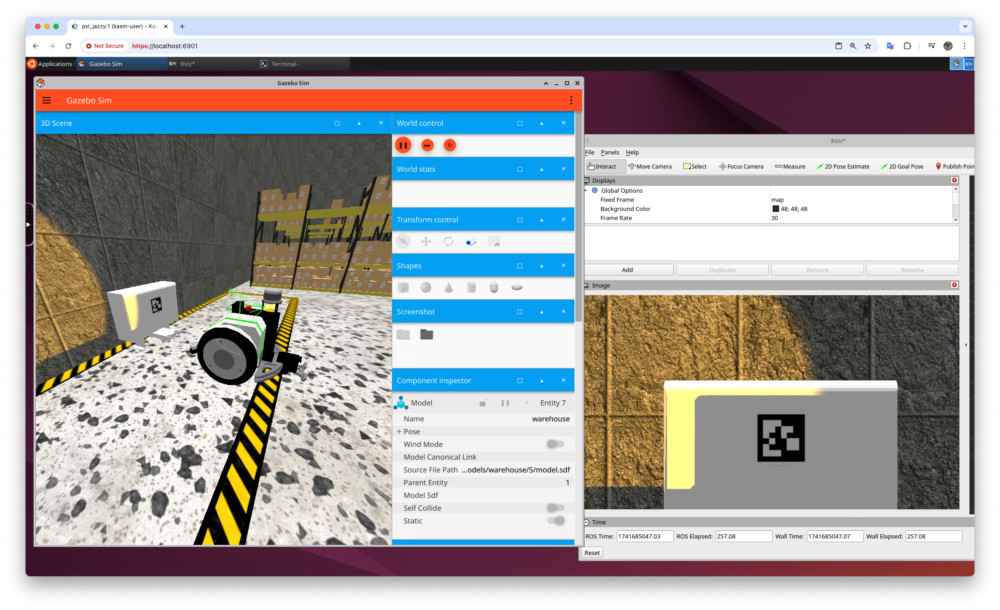
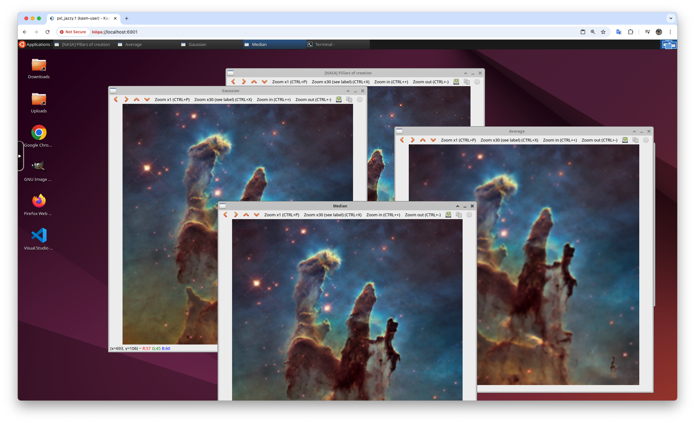

# PXL ROS2 Development Environment

This repository provides a Docker container for ROS2 Jazzy that includes **KasmVNC**, allowing users to access the Xfce desktop environment via HTTPS for running simulations and other ROS2 applications.

For Windows users, there is also an alternative setup with a virtual machine.

## Features
- **Ubuntu 24.04 Docker container** with **ROS2 Jazzy** pre-installed.
- **KasmVNC** for desktop access within the container.
- **Xfce Desktop** accessible via port **6901**. ([https://localhost:6901](https://localhost:6901) user: ``kasm_user`` password: ``password``.)
- Scripts to build, run, attach, stop, and remove the container and image.

## Requirements
- **Windows (VM setup)**: VMware Workstation (Player/Pro).
- **Linux/macOS (Docker setup)**: Docker installed on your system ([Install Docker](https://docs.docker.com/get-docker/)).
- **Optional (Docker GPU accel)**: NVIDIA GPU + drivers + NVIDIA Container Toolkit.

## Recommended Environment

Pick **one** of the setups below:

- **Windows users**: use the **VMware VM** (recommended for the workshop). Jump to: [Windows Setup (VMware VM)](#windows-setup-vmware-vm)
- **Linux/macOS users**: use the **Docker + KasmVNC** environment from this repo. Jump to: [Linux/macOS Setup (Docker + KasmVNC)](#linuxmacos-setup-docker--kasmvnc)


## Windows Setup (VMware VM)

On Windows, GPU acceleration inside the KasmVNC Docker image can be unreliable depending on drivers/hardware. For workshops we recommend using a **prebuilt Ubuntu VM** that mirrors the tooling and folder layout used in the container.

- **VM download**: [Link](https://drive.google.com/file/d/1_3t9sCrLikfFIGgb2dHSEAXyMsm5wYCE/view?usp=sharing)
- **Hypervisor**: VMware Workstation (Player/Pro)

### VM setup (VMware Workstation)
1. Install VMware Workstation (Player or Pro).
2. Import/open the downloaded VM.
3. Allocate resources (see [Troubleshooting](#troubleshooting) for guidelines).
4. Start the VM and log in:
   - user: `kasm_user`
   - password: `password`

### Testing inside the VM

#### ROS2
Open a terminal and run:

```
ros2 run example_package example_node
```

If everything is set up correctly, you should see output similar to:

```
Hi from example_package.
```

#### Gazebo simulator
To test Gazebo, run:

```
gz sim
```

Start either the Prius On Sonoma Raceway or the Tugbot in Warehouse environment. Verify it's not flickering. If it is, go to the [Troubleshooting](#troubleshooting) section below.

## Linux/macOS Setup (Docker + KasmVNC)

Use the Docker-based KasmVNC environment from this repo (`pxl_ros2_jazzy_image`). Hardware acceleration tends to work well here, and everyone gets the same ROS2 Jazzy desktop setup in the browser.

## Installation & Usage (Docker)

### 1. Clone the Repository
```sh
git clone https://github.com/PXLAIRobotics/ROS2JazzyDocker.git
cd ROS2JazzyDocker
```

### 2. Build the Docker Image
```sh
./001_build_pxl_ros2_jazzy_image.sh
```

### 3. Run the Docker Container
```sh
./002_run_pxl_ros2_jazzy_container.sh
```

### 4. Access the Container via Bash
```sh
./003_attach_bash_to_pxl_ros2_jazzy_container.sh
```

### 5. Stop the Container
```sh
./997_stop_pxl_ros2_jazzy_container.sh
```

### 6. Remove the Container
```sh
./998_remove_pxl_ros2_jazzy_container.sh
```

### 7. Remove the Docker Image
```sh
./999_remove_pxl_ros2_jazzy_image.sh
```

## Accessing the Desktop Environment
After running the container, you can access the **KasmVNC** desktop by opening a web browser and navigating to:
```
https://localhost:6901
```
Default login credentials:
- **Username:** `kasm_user`
- **Password:** `password`

### Testing inside the Docker desktop


#### ROS2
To verify that ROS2 Jazzy is running correctly, follow these steps:

Open a terminal by clicking the `Applications` menu in the **top left corner** and selecting `Terminal Emulator`.

Run the following command to start an example ROS 2 node:

```
ros2 run example_package example_node
```

If everything is set up correctly, you should see output similar to:

```
Hi from example_package.
```

This confirms that ROS 2 is properly installed and functional within the container.


#### Gazebo simulator
To test Gazebo, run:

```
gz sim
```

Start either the Prius On Sonoma Raceway or the Tugbot in Warehouse environment. 


## Showcase
Below are screenshots showcasing the usage of this ROS 2 Jazzy Docker container:

### Ubuntu Desktop

<p align="center">
  
</p>

### Running ROS 2 Simulation

<p align="center">
  
</p>

### OpenCV Example

<p align="center">
  
</p>

## Customization
- Modify the `Dockerfile` in `pxl_ros2_jazzy_image` to add additional dependencies.
- Update the scripts to configure network settings, volumes, or GPU access.

## Troubleshooting

### Gazebo / `gz sim` flickering (VMware / Windows VM)
Symptom: `gz sim` renders but the image **flickers constantly**.

Fix (recommended): in VMware settings for the VM:
- Disable **Accelerate 3D graphics**

Why: VMware’s virtual 3D/OpenGL path can introduce rendering artifacts for Gazebo. Disabling it forces software rendering (more stable, usually slower).

Typical console messages you may see after disabling 3D (expected):
- `VMware: No 3D enabled (0, Success).`
- `libEGL warning: egl: failed to create dri2 screen`

Optional verification inside the VM:
```sh
glxinfo -B | egrep 'OpenGL renderer|OpenGL version'
```
If you see `llvmpipe`, you are on software rendering.

### VM resource sizing (performance)
Gazebo and RViz can be CPU/RAM intensive, especially with software rendering.

Guidelines for a smoother experience:
- **RAM**: allocate at least **8 GB** (recommended **12–16 GB** if available).
- **CPU**: allocate at least **4 vCPUs** (recommended **6–8 vCPUs** if available).

If the VM feels sluggish:
- Close unused applications inside the VM.
- Reduce Gazebo window size / resolution.
- Prefer simpler worlds or lower visual fidelity where possible.

## Contributing
Feel free to fork this repository and submit pull requests for improvements or additional features.

## License
This project is licensed under the MIT License - see the [LICENSE](LICENSE) file for details.

## Third-Party Code Attribution
This project includes code from third-party sources:

- **Kasm Technologies**
  - The `src/` directory in `pxl_ros2_jazzy_image/` is a direct copy from Kasm Technologies' repository.
  - Portions of Kasm Technologies' code are also used in the `Dockerfile` with modifications.
  - Their original MIT license is retained in `pxl_ros2_jazzy_image/src/LICENSE`.

All third-party code follows their respective licenses.

## Author
Maintained by **Tim Dupont** ([GitHub Profile](https://github.com/TimDupontPXL)) and **Sam van Rijn** ([GitHub Profile](https://github.com/samvr-pxl)).

## Acknowledgments
Special thanks to:
- **Kasm Technologies** for developing **KasmVNC**, enabling seamless remote desktop access.
- **Open Source Robotics Foundation (OSRF)** for their continued work on **ROS2**.
- **Intel**, **Willow Garage**, **Itseez**, and the OpenCV community for developing and maintaining OpenCV, a powerful computer vision library widely used in robotics and AI.
- **Canonical** for maintaining **Ubuntu**, the foundation of this Docker container.
- The broader **open-source communities** that contribute to these technologies and make innovation possible.

